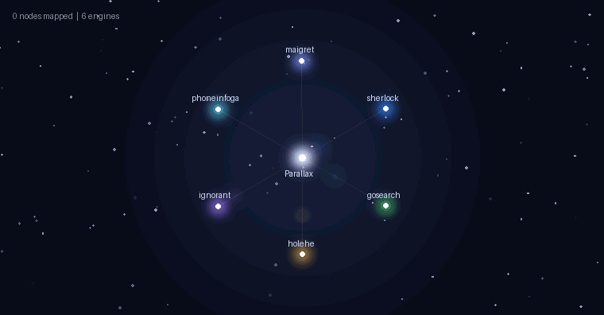

# ✦ Parallax

*Triangulate a digital footprint across the galaxy.*

<p align="center">
  <a href="https://Abrartxt-parallax.hf.space"></a>
</p>

<p align="center">
  <b>▶ Try it live: <a href="https://Abrartxt-parallax.hf.space">Abrartxt-parallax.hf.space</a></b>
</p>

<p align="center">
  
</p>

<p align="center"><em>Live constellation map: the query is the center star, each engine a glowing hub, and every account found streams in as a connected node — breaches flare red. Zoom, pan, and hover in the real app.</em></p>

One web UI that fans a single identifier — **username, email, phone, or full name** —
out to multiple best-in-class OSINT engines, streams results live, correlates them,
and gives you one combined report.

It does **not** reimplement anything. It orchestrates existing tools via subprocess,
normalizes their output into one schema, and pivots discovered identifiers back in.

```
 input ──▶ detect kind ──▶ fan to engines ──▶ normalize ──▶ dedup ──▶ pivot ──▶ report
             maigret / sherlock / gosearch / holehe / ignorant / phoneinfoga
```

> ⚗️ **Research prototype.** Parallax is built for education and **authorized** OSINT
> research — it is **not** a commercial product or a professional investigation service.
> Provided **as-is, with no warranty**. Results may be incomplete, inaccurate, or belong to
> a different person who shares the same identifier. You are solely responsible for lawful,
> authorized use (see [Legal & ethics](#-legal--ethics)).

## Features

- 🌌 **Live constellation map** — the query is the center star, each engine a glowing
  hub; findings stream in as connected star-nodes. **Scroll to zoom, drag to pan**,
  hover to inspect, click to open. Breach nodes flare red with a supernova ring.
- ⚡ **Parallel + streaming** — every engine *and* every pivot handle runs concurrently;
  results appear **as they're found**, with a live per-engine progress panel.
- ⏹ **Stoppable** — cancel mid-scan; the whole subprocess tree is killed in ~1s and the
  results found so far are kept.
- 🧭 **Explore Further** — after the scan, 445 curated [OSINT Framework](https://osintframework.com)
  tools matched to your input type, as manual next-step pivots.
- 🧹 **Removal Assistant** — deletion links + GDPR/DPDP erasure requests for accounts you own.
- 🎚 **Fast / Deep** — maigret depth toggle (top-500 vs all ~3000 sites).
- 🔐 **Google sign-in** (optional, for hosting) · 📤 **JSON export** of results.

## Engines

| Engine | Input | Role | Install |
|--------|-------|------|---------|
| [maigret](https://github.com/soxoj/maigret)         | username | all ~3000 sites + profile data | `pip` |
| [sherlock](https://github.com/sherlock-project/sherlock) | username | fast 400+ site confirm | `pip` |
| [gosearch](https://github.com/ibnaleem/gosearch)    | username | 300+ sites + **breach check** (HudsonRock + ProxyNova) | binary → `./bin` |
| [holehe](https://github.com/megadose/holehe)        | email    | which of 120+ sites an email is registered on | `pip` |
| [HudsonRock](https://www.hudsonrock.com/free-tools) | email    | **info-stealer breach intel** — compromise date + exposed services | free API |
| [ignorant](https://github.com/megadose/ignorant)    | phone    | phone registered on Instagram / Amazon / Snapchat | `pip` |
| [phoneinfoga](https://github.com/sundowndev/phoneinfoga) | phone | country/carrier + Google dork links | binary → `./bin`, or Docker |

Engines are resolved from `PATH`, the venv `Scripts/` dir, and the project `./bin`.
Any engine not found is auto-skipped (shown greyed-out in the UI). Breach hits are
highlighted red in the results table.

### Standalone binaries (gosearch, phoneinfoga)
Both are Go binaries. Fetch prebuilt Windows releases into `./bin`:

```powershell
.\scripts\fetch-binaries.ps1
```

**phoneinfoga via Docker** (alternative — no binary needed): if `phoneinfoga` is not
in `./bin`/PATH but `docker` is present, the engine automatically runs
`docker run --rm sundowndev/phoneinfoga scan -n <number>`.

## Deploy (cloud)

**Live now on Hugging Face Spaces → <https://Abrartxt-parallax.hf.space>**

Runs open locally; add Google sign-in and host it free (Hugging Face Spaces or
Render) — see **[DEPLOY.md](DEPLOY.md)**. (Cloudflare Pages/Workers can't run it —
it's a Python server with subprocess engines; it needs a container host.)

## Correlation / pivot

- **email** → the local part (`ravi.kumar@x.com` → `ravi.kumar`) is re-run through username engines.
- **name** → generates handle variants (`ravikumar`, `ravi.kumar`, `ravi_kumar`) and runs the top 2.
- Results from every engine are deduped by `(site, url, value)`.

## Setup

```powershell
# from the project root
.\run.ps1            # creates .venv, installs deps, starts server
```

Then open <http://127.0.0.1:8000>.

For gosearch + phoneinfoga, also run `.\scripts\fetch-binaries.ps1` once (see above).

## Removal Assistant

After a search, tick the accounts you own and click **Removal plan**. For each
selected account the app returns:

- the platform's **direct account-deletion link** + difficulty (easy/medium/hard/impossible)
- a pre-drafted **GDPR Art.17 / India DPDP 2023 "right to erasure"** email you can send

It does **not** delete anything automatically — no platform lets an outside app
delete an account without your login and its own confirmation flow. This is
guidance + request-generation only. Breach/leak findings are excluded (you can't
"delete" a leak — rotate those passwords and enable 2FA).

Deletion recipes live in [`app/data/removal_db.json`](app/data/removal_db.json)
(inspired by justdelete.me); unknown sites fall back to generic settings + an
erasure request.

## Explore Further (OSINT Framework)

The automated engines can't cover every source — many OSINT resources are manual
(websites, Google dorks, paid lookups). After each scan, Parallax surfaces a
categorized **Explore Further** panel: 445 curated resources from the
[OSINT Framework](https://osintframework.com) (MIT), filtered to the detected
input kind, with a *free & no-signup* toggle. These open for you to pursue — they
are deliberately **not** auto-run.

Data lives in [`app/data/osint_framework.json`](app/data/osint_framework.json).

## Fast vs Deep (maigret)

maigret is the deepest engine. A **Deep scan** checks all ~3000 sites (best coverage,
slower, batches at the end); **Fast** checks the top 500 (quicker, lighter). Toggle it
per search in the UI. The server default comes from `MAIGRET_DEEP` (Deep locally; the
cloud deploy sets Fast to stay within free-tier memory).

## Notes / limits
- **Python 3.14**: some engines may lack wheels yet. If `pip install` fails for one,
  the app still runs — that engine just shows as missing. Pin `python 3.11–3.12` if needed.
- holehe / gosearch upstreams move fast; parsers here are best-effort against current CLI output.
- **Cloud deploy**: see [DEPLOY.md](DEPLOY.md) — needs a container host (Render/Fly/Railway)
  fronted by Cloudflare; Cloudflare Pages/Workers alone can't run the engines.

## ⚠️ Legal & ethics

**Status: research prototype.** This project is an educational proof-of-concept, not a
finished or commercial product. It comes with **no warranty and no guarantee of accuracy** —
results can be wrong, stale, or belong to someone else who happens to share a username or
name. Do not treat any result as proof that a person created or controls an account.

Use only against targets you are **authorized** to investigate — your own accounts,
consented subjects, sanctioned pentest scope, or lawful investigations.
No Aadhaar/PAN/voter-ID/bank lookups — those are illegal under India's IT Act & DPDP Act 2023.
Public-profile OSINT only. **You are solely responsible for how you use this**, and for
complying with all applicable laws and the terms of service of every platform queried.
